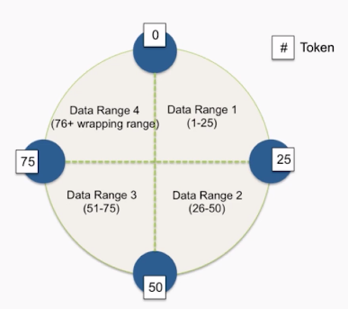
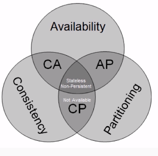
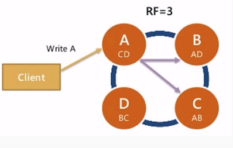
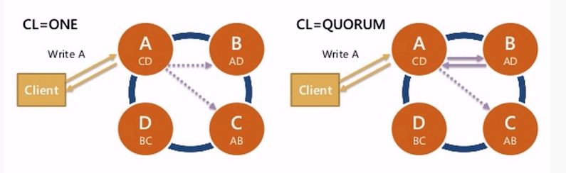
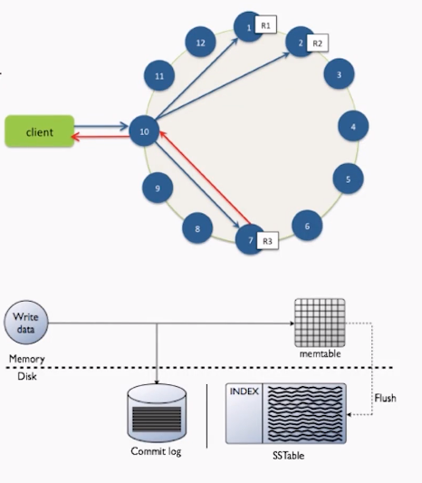

# Introduction to Apache Cassandra DS101

## Relational Overview

### RDMBS for big data

- For Big Data, Replication: ACID is a lie.
- 3NF does not scale
    - Queries are unpredictable
    - Users are impatient
    - Data must be denormalized
    - If data > memory, you = history
    - Disk seeks are the worst

### Sharding is a nightmare
- Data is all over the place
- No more joins
- No more aggregations
- Denormalize all the things
- Querying secondary indexes requires hitting every shard
- Adding shards requires manually moving data
- Schema changes

### High availability...not really
- Master failover...who's responsible?
    - Another moving part
    - Bolted on hack
- Multi-DC is a mess
- Dowtime is frequent
    - Change database settings (innodb buffer pool, etc)
    - Drive, power supply failures
    - OS updates

### Summary of failure
- Scaling is a pain
- ACID is naive at best
    - You aren't consisten
- Re-sharding is a manual process
- We're going to denormalize for performance
- High availability is complicated, requires additional operational overhead

### Lessons learned
- Consistency is not practical
    - So we give it up
- Manual sharding & rebalancing is hard
    - So let's build in
- Every moving part makes systems more complex
    - So let's simplify our architecture - no more master/slave
- Scaling up is expensive
    - We want commodity hardware
- Scatter / gather queries are no good

## Cassandra Overview

### What is Apache Cassandra
- Fast distributed database
- Hight availability
- Linear scalability
- Predictable performance
- No SPOF
- Multi DC
- Commodity hardarware
- Easy to manage operability
- Not a drop in replacement for RDBMS

### Hash Ring
- No master / slave / replica sets
- No config servers, zookeeper
- Data is partitioned around the ring
- Data is repllicated to RF = N servers
- All nodes hold data and can answer queries (both reads and writes)
- Location of data on ring is determined by partition key

### CAP Tradeoffs
- Impossible to be both consistend and highly available during a network partition
- Latency between data centers also makes consistency impractical
- Cassandra chose Availability and Partition Tolerance over Consistency

### Replication
- Data is replicated automatically
- You pick the number of servers
- Called "Replication Factor" or RF
- Data is ALWAYS replicated to each replica
- If a machine is down, missing data is replayed via hinted handoff

### Consistency Levels
- Per query, consistency
- ALL, QUORUM, ONE
- How many replicas for query to respond OK

### Multi DC
- Typical Usage: clients write to local DC, replicates async to other DCs
- Replication factor per keyspace per datacenter
- Datacenters can be physical or logical

## Internals and Distribution

### The Write Path
- Writes are written to any node in the cluster (coordinator)
- Writes are written to commit log, then to memtable
- Every write includes a timestamp
- Memtable flushed to disk periodically (sstable)
- New memtable is created in memory
- Deletes are a special write case, called a "tombstone"

### What is an SSTable
- Immutable data file for row storage
- Every write includes a timestamp of when it was written
- Partition is spread accross multiple SSTables
- Same column can be in multiple SSTables
- Merged through compaction, only latest timestamp is kept
- Deletes are written as tombstones
- Easy backups
 
### The Read Path
- Any server may be queried, it acts as the coordinator
- Contacts node with the requested key
- On each node, data is pulled form SSTables and merged
- Consistency < ALL performs read repair in background (read_repair_chance)
