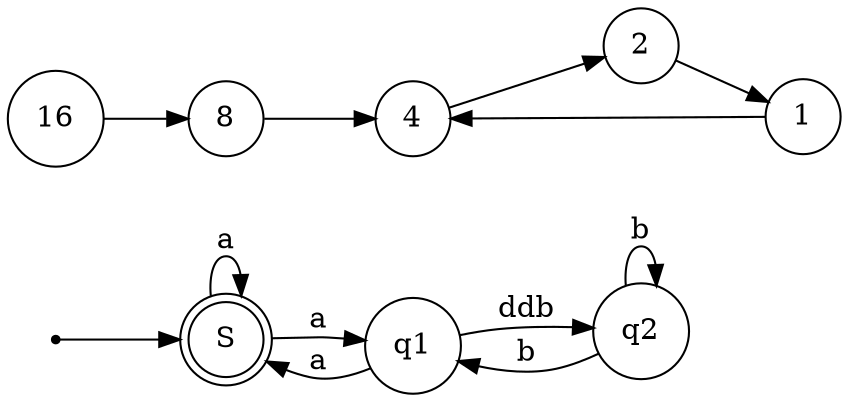

# Message Handlers

## HttpRequestMessage

- Properties
  - Content
  - Headers
  - Method
  - Properties
  - RequestUri
  - Version
- Methods
  - Dispose (+1 overload)
  - HttpRequestMessage (+2)
  - ToString()

## HttpResponseMessage

- Properties
  - Content
  - Headers
  - IsSuccesfulStatusCode
  - ReasonPhrase
  - RequestMessage
  - StatusCode
  - Version
- Methods
  - Dispose
  - EnsureSuccessStatusCode
  - HttpResponseMessage()
  - ToString()

## DelegatingHandler
Abstract Class

An intermediary handler that knows how to pass of request and messages from one handler to another.

- Properties
  - InnerHandler
- Methods
  - DelegatingHandler
  - Dispose
  - SendAsync()

## HttpMessageHandler
AbstractClass

Receives an HTTP request, and returns an HTTP response.

- Methods
  - Dispose
  - HttpMessageHandler
  - SendAsync

