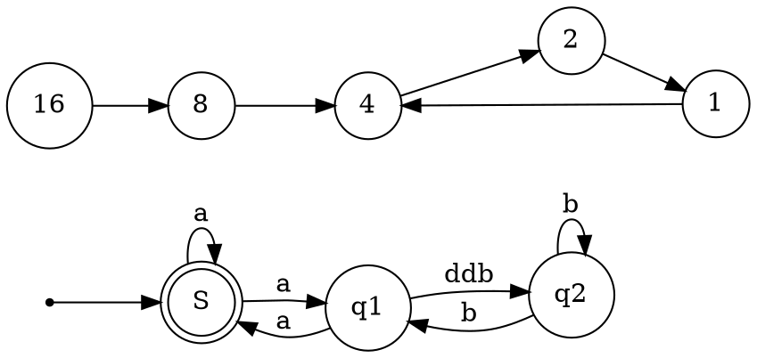

# Message Handlers

## HttpMessageHandler
AbstractClass

Receives an HTTP request, and returns an HTTP response.

- Methods
  - Dispose
  - HttpMessageHandler
  - SendAsync

## DelegatingHandler
Abstract Class

An intermediary handler that knows how to pass of request and messages from one handler to another.

- Properties
  - InnerHandler
- Methods
  - DelegatingHandler
  - Dispose
  - SendAsync()

