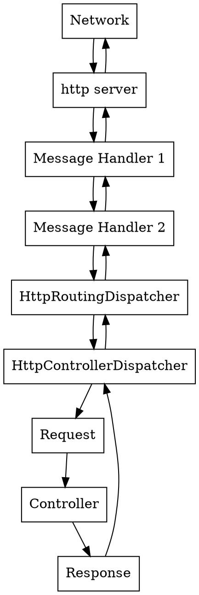

# Server side message handlers.

- `HttpServer`: receives request from host.
- `HttpRoutingDispatcher`: dispatches request based on route.
- `HttpControllerDispatcher`: sends request to the WebApi controller

Plus your very own custom handlers.

